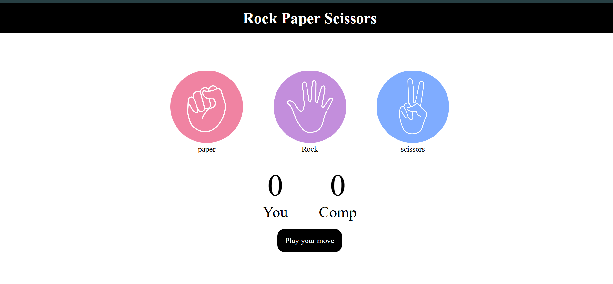

# 🪨📄✂️ Stone Paper Scissors Game

A simple and fun **Stone Paper Scissors** (Rock Paper Scissors) game built using **HTML**, **CSS**, and **JavaScript**.

## 🎮 Live Demo

> 🔗 [https://akashraj2106.github.io/stone-paper-scissors-game/](#)  
*(Replace with your deployed link if available)*

## 📸 Screenshot

  
*(Make sure to add a `screenshot.png` of your game in the repo)*

## 🚀 Features

- Interactive UI with basic animations
- Score tracking for both user and computer
- Random computer moves
- Win/Lose/Draw logic with color-coded feedback

## 🛠️ Tech Stack

- HTML5
- CSS3
- JavaScript (Vanilla)

## 📂 Project Structure

stone-paper-scissors/
├── index.html
├── style.css
├── script.js
└── README.md

bash
Copy
Edit

## ⚙️ How to Run Locally

1. Clone the repository
   ```bash
   git clone https://github.com/your-username/stone-paper-scissors.git
Navigate to the folder

bash
Copy
Edit
cd stone-paper-scissors
Open index.html in your browser

👨‍💻 Author
Akash Raj

GitHub: @Akashraj2106